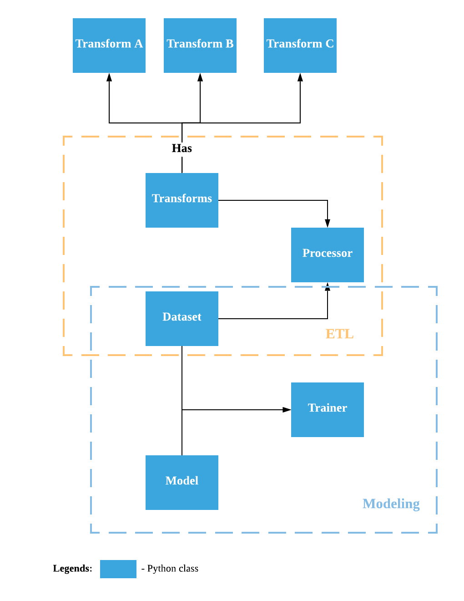

# SFL Scientific Project Template

&nbsp;&nbsp;&nbsp;&nbsp;&nbsp;&nbsp;&nbsp;&nbsp;&nbsp;&nbsp;&nbsp;&nbsp;&nbsp;&nbsp;&nbsp;&nbsp;&nbsp;&nbsp;&nbsp;

## What is SFL Scientific Project Template?

> "The centre of your data pipeline."

The template applies software engineering best-practice to data and machine-learning pipelines. You can use it, for example, to optimise the process of taking a machine learning model into a production environment. You can use the template to organize a single user project running on a local environment, or collaborate within a team on an enterprise-level project.

We provide a standard approach so that you can:

 - Worry less about how to write production-ready code,
 - Spend more time building data pipelines that are robust, scalable, deployable, reproducible and versioned,
 - Standardize the way that your team collaborates across your project.

## How do I use SFL Scientific Template?

* See the demo branch for a typical "Hello World' Example.
* See `README.Template.md` for a README documentation example.

## Why does the template exist?

The template is built upon our collective best-practice (and mistakes) trying to deliver real-world ML applications that have vast amounts of raw unvetted data. We developed the template to achieve the following:

 - **Collaboration** on an analytics codebase when different team members have varied exposure to software engineering best-practice
 - A focus on **maintainable data and ML pipelines** as the standard, instead of a singular activity of deploying models in production
 - A way to inspire the creation of **reusable analytics code** so that we never start from scratch when working on a new project
 - **Efficient use of time** because we're able to quickly move from experimentation into production

## Architecture Template Overview

Here is a diagram showing high-level architecture of the template:

&nbsp;&nbsp;&nbsp;&nbsp;&nbsp;&nbsp;&nbsp;&nbsp;&nbsp;&nbsp;&nbsp;&nbsp;&nbsp;&nbsp;&nbsp;&nbsp;&nbsp;&nbsp;&nbsp;

The template consists of the following main components:

| Component        | Description   |
| ---------------- |:-------------|
| Dataset      | An object that can be used to form the data pipeline. |
| Transforms      | A collection of `Transform` objects. By default, the `Transforms` object takes `Dataset` object as input and output `Dataset` object as well.      |
| Transform | An object that runs python functions which executes some business logic, e.g: data cleaning, dropping columns, splitting data.      |
| Processes | An object that runs data pipeline which `Dataset` Object and `Transforms` Object      |
| Builder | A singleton object to build machine learning model from config file.      |
| Trainer | An object to take `Dataset` object and `Model` object to encapsule the training process.      |
